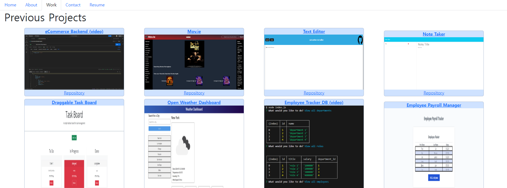

# react-portfolio

## Table of Contents

<ol>
<li>
<a href="#description"> Description </a>
</li>
<li><a href="#installation"> Installation </a>
</li>
<li>
<a href="#executing-program"> Executing program </a>
</li>
<li><a href="#usage"> Usage </a>
</li>
<li><a href="#contribution"> Contribution </a>
</li>
<li>
<a href="#tests"> Tests </a>
</li>
<li>
<a href="#screenshot"> Screenshot </a>
</li>
</ol>

## Description

My react portfolio!

## Installation

```
npm run install
```

Lots of react related dependencies

## Executing program

After installation
<br>

```
npm run start
```

Run the local host: https://localhost:3000/

## Usage

Look at my react portfolio

## Contribution

Git clone or fork the repository and create a feature for me ❤️

## Tests

Give it a shot!
<br>
Deployed on netlify:
<br>
https://eliot-react-portfolio.netlify.app


## Screenshot
The following image shows the web application's appearance and functionality:
